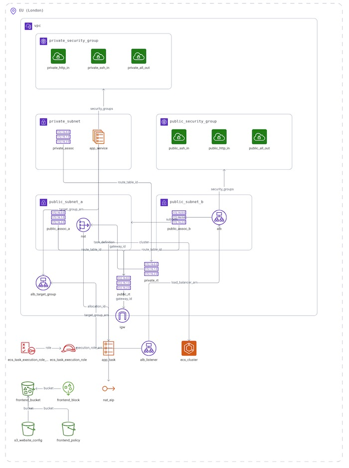

# Jenkins Project

This project demonstrates a CI/CD pipeline using **Jenkins**, **Docker**, **AWS ECR**, and **AWS ECS (Fargate)**. The application is built, containerized, and deployed automatically on code changes via GitHub.

## Overview

The project consists of:
- A Node.js backend application
- A React / Vite frontend
- A Dockerized build process
- A Jenkins pipeline  

## Project Structure

```
jenkins-project/
├── backend/                      # Node.js app
├── frontend/                     # React-based frontend (Vite)
├── terraform/                    # Infrastructure as Code (AWS)
├── Jenkinsfile                   # CI/CD pipeline configuration
├── README.md
└── .gitignore
```

## Technologies Used

- **Jenkins** – CI/CD automation
- **Docker** – Containerization
- **AWS ECR** – Docker image repository
- **AWS ECS (Fargate)** – Serverless container hosting
- **Terraform** – Infrastructure provisioning
- **GitHub** – Source control and webhook trigger

## Deployment Pipeline

1. **GitHub push** triggers Jenkins.
2. Jenkins:
   - Checks out code from GitHub
  - Carries out unit testing on backend
  - Builds a backend Docker image
  - Pushes the image to AWS ECR
  - Deploys it to AWS ECS using Fargate
  - Terraforms all AWS infrastructure
  - Builds the web app frontend
  - Uploads frontend to S3 bucket configured for hosting

## 📷 Architecture Diagram



## AWS Credentials

Jenkins is configured with the appropriate IAM credentials using a credentials binding plugin. Ensure the ECR and ECS policies are attached.

## Terraform State

The Terraform state is stored remotely in an existing S3 bucket. Ensure the S3 is configured in `terraform/main.tf` and the bucket is created before running `terraform init`.

## License

This project is licensed under the MIT License.